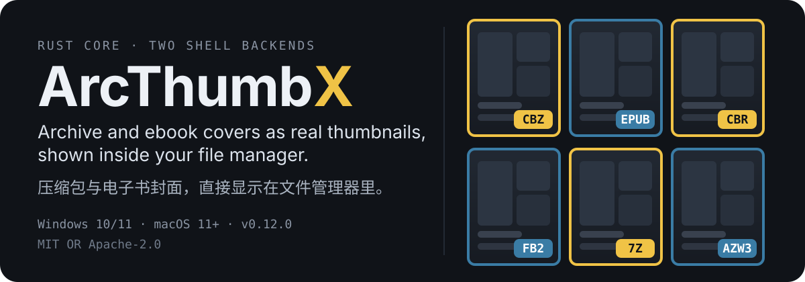
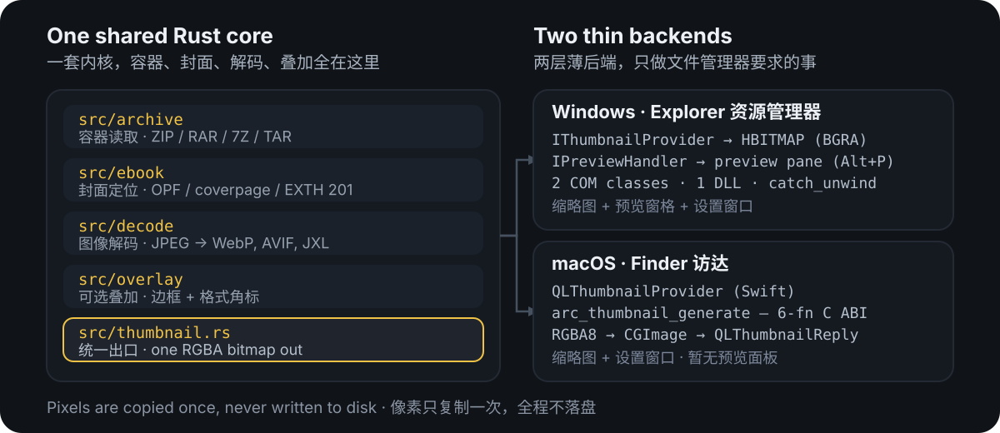
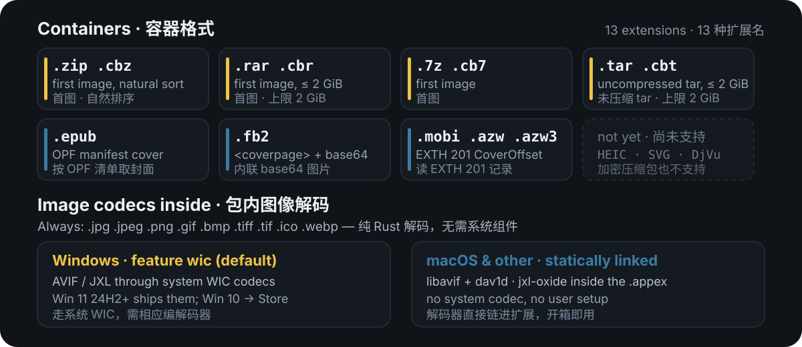

<p align="center">
  
</p>

<p align="center">
  <a href="./README.md"></a>
  <a href="#许可证"></a>
  <a href="https://github.com/HibernalGlow/ArcThumbX/releases"></a>
  
</p>

ArcThumbX 把压缩包和电子书的**封面放到你列表文件的地方**——Windows 资源管理器和 macOS
访达里的缩略图。两个前端都只是同一套 Rust 内核之上的薄壳，所以同一个 `.cbz` 和它的
`.epub` 邻居在两个平台上得到相同的封面、相同的排序规则和相同的解码器。支持的格式包括漫画
压缩包（ZIP、CBZ、RAR、CBR、7Z、CB7、TAR、CBT）与电子书（EPUB、FB2、MOBI、AZW、AZW3）。

本仓库是 [citrussoda-com/ArcThumb](https://github.com/citrussoda-com/ArcThumb) 的 fork，
改动内容见[关于本 fork](#关于本-fork)。

## 先看效果

资源管理器，缩略图已开启，右侧预览窗格打开（`Alt+P`）：


同一个文件夹开启「识别叠加」后的样子——按格式族上色边框加角标，压缩包封面不会再被误认成一张普通图片：


## 你能得到什么

- **是封面，不是通用图标。** 压缩包内第一张合格图片成为该文件的缩略图；存在
  `cover.*`、`folder.*`、`thumb.*`、`thumbnail.*`、`front.*` 时优先选它。
- **按格式自己的规则找电子书封面。** EPUB 走 OPF 清单，FB2 走 `<coverpage>`，
  MOBI/AZW/AZW3 走 EXTH 201 的 `CoverOffset` 记录——取的是真正的封面，而不是恰好排在最前的图。
- **Windows 的预览窗格。** `IPreviewHandler` 把同一张封面按窗格高度铺满，拖动分隔条会跟着缩放。
- **可选叠加层**（默认关闭）：压缩包系用琥珀色、电子书系用蓝色，角标写着 `CBZ`、`EPUB` 等。
- **两个平台同一个设置窗口**——按扩展名、按图像格式的开关，排序方式、封面偏好、叠加开关、
  诊断日志，还有一个「重新生成缩略图」按钮。界面提供 English、日本語、简体中文。
- **不落盘。** 像素在内存里交给外壳程序，生成缩略图的过程不写任何临时图片。
- **Windows 上不会连带崩溃。** 每个 COM 入口都包在 `catch_unwind` 里，解码器 panic
  也拖不垮资源管理器、`dllhost.exe` 或 `prevhost.exe`。

## 快速上手

### Windows

发布物是便携 zip——不需要安装程序，也不需要管理员权限。

```powershell
# 1. 把 ArcThumb-<version>-portable-x64.zip 解压到一个固定位置，
#    例如 %LOCALAPPDATA%\Programs\ArcThumb
# 2. 注册外壳扩展（写入 HKCU）：
arcthumb-config.exe --install
```

新文件立刻就有缩略图；按 `Alt+P` 打开预览窗格。想装成整机生效，就用**管理员身份**运行同一条
命令，改为写入 `HKLM`——资源管理器运行在高完整性级别时必须要这样（例如 Windows 沙盒）。
卸载：先 `arcthumb-config.exe --uninstall`（两个注册表根都会清理），再删掉那个目录。

### macOS

```sh
# 1. 把 ArcThumb-<version>-macOS-arm64.zip 解压到 /Applications 或 ~/Applications
# 2. 发布版是 ad-hoc 签名的，先清一次隔离属性：
xattr -dr com.apple.quarantine ~/Applications/ArcThumb.app
# 3. 让访达启用这个扩展：
pluginkit -e use -i com.citrussoda.ArcThumb.thumbnail
qlmanage -r cache
```

同样的开关也在**系统设置 → 隐私与安全性 → 扩展 → 缩略图扩展**里。Intel 机器请取
`…-macOS-x86_64.zip`；两个架构的切片各自由对应架构的机器编译，而不是 lipo 合并——内置的
AVIF 解码器没有 macOS 交叉编译配置。x86_64 这条流水线还**没在真实 Intel 硬件上验证过**，
[macos/README.md](./macos/README.md) 里也写明了这一点。

想自己编译：`./macos/build-appex.sh --release --install` 一步完成编译与注册，细节见
[macos/README.md](./macos/README.md)。

## 它是怎么拼起来的



与平台无关的部分全在内核里：容器读取、电子书封面定位、图像解码（含 AVIF 与 JXL）、缩放和
叠加绘制。`src/thumbnail.rs` 把它们串起来，输出一张 RGBA 位图。每个后端只加自己平台文件管理器
要求的那一点：

| 平台 | 后端 | 像素交接 |
|---|---|---|
| Windows | 一个 DLL 里的两个 COM 类：`IThumbnailProvider` + `IPreviewHandler`，按扩展名写注册表绑定 | `RgbaImage` → 预乘 BGRA DIB section（`HBITMAP`） |
| macOS | 按 UTI 匹配的 `QLThumbnailProvider` 应用扩展（`macos/`），外加设置窗口 | `RgbaImage` → 预乘 RGBA8 → `CGDataProvider` → `CGImage`，经由六个函数的 C ABI（`macos/arcthumb-ffi`） |

两个后端都不重新实现压缩包或图像逻辑。Windows 上两个 CLSID 默认注册在 `HKCU`，因此安装与卸载
ArcThumbX 不碰整机注册表；以管理员身份安装时改走 `HKLM`。更深入的说明：
[WIC_IMPLEMENTATION.md](./docs/WIC_IMPLEMENTATION.md)、
[MACOS_IMPLEMENTATION.md](./docs/MACOS_IMPLEMENTATION.md)。

## 支持的格式



内核能打开 13 种容器扩展名：

| 扩展名 | 类型 | 取封面的方式 |
|---|---|---|
| `.zip` `.cbz` `.rar` `.cbr` `.7z` `.cb7` `.tar` `.cbt` | 压缩包 | 按排序取第一张合格图像，优先封面命名的文件 |
| `.epub` | EPUB 2 / 3 | OPF 清单里的封面引用 |
| `.fb2` | FictionBook 2 | `<coverpage>` 引用，正文内联 base64 图像 |
| `.mobi` `.azw` `.azw3` | Kindle | EXTH 201 的 `CoverOffset` 记录 |

Windows 为其中 12 种写 ShellEx 绑定（不绑定裸 `.tar`，但绑定 `.cbt`）；macOS 扩展通过 UTI
声明了全部 13 种。

容器内部的图像：`.jpg` `.jpeg` `.png` `.gif` `.bmp` `.tiff` `.tif` `.ico` `.webp` 在所有平台
都由纯 Rust 解码。`.avif` 与 `.jxl` 分平台：

- **Windows** —— 默认的 `wic` 特性走系统 Windows Imaging Component 编解码器。Windows 11
  24H2+ 通常自带 AVIF；Windows 10 需要从 Microsoft Store 安装
  [AV1 Image Extensions](https://apps.microsoft.com/detail/9n26s50ln705) 和/或某个 JPEG XL
  扩展。用 `--no-default-features` 编译即可不带它们。
- **macOS 及其他目标** —— libavif + dav1d 与 `jxl-oxide` 静态链接进扩展本体，既不依赖系统
  编解码器，也不需要用户额外配置。

## 设置项

Windows 从开始菜单打开 **ArcThumb Configuration**。macOS 上同一个窗口就是
**ArcThumb.app**——同一套 Slint 界面，读写的是扩展的设置文件。


- **启用的扩展名** —— 逐个扩展名开关缩略图功能。
- **用于缩略图的图像格式** —— 决定压缩包内哪些格式有资格作为缩略图来源；关掉某格式就是跳过该
  扩展名的文件。电子书不受此项影响，它们用自己的元数据。
- **排序方式** —— 定义什么是「第一张」。自然排序认为 `page2.jpg` 小于 `page10.jpg`，是默认值，
  漫画通常要的就是它；字母序相反。
- **封面图像** —— *有封面则用封面，否则用第一页*（默认）；*仅用封面*（没有封面命名的文件就完全
  不出缩略图，于是一个恰好夹了一张图的无关 ZIP 不会被借走当封面，仍是普通压缩包图标）；
  *始终用第一页*（忽略这些名字，按排序取第一张）。
- **启用预览窗格** —— 一个开关，一次性为所有支持的扩展名注册或注销 `IPreviewHandler`。
  在 macOS 上此行为禁用状态，访达那边暂时还没有对应能力。
- **彩色边框 / 格式角标** —— 两个叠加开关。角标在能读出扩展名时用扩展名，否则用探测到的格式；
  图标太小放不下时会丢掉角标、保留边框。
- **启用诊断日志** —— 在系统临时目录写 `arcthumb.log`（Windows 是 `%TEMP%`，macOS 是
  `$TMPDIR`）。也可以用 `arcthumb-config --log-on` / `--log-off` 切换。
- **语言** —— English、日本語、简体中文。Windows 首次运行时按 `GetUserDefaultLocaleName`
  选择，之后记在 `HKCU\Software\ArcThumb\Language`；macOS 给 `ArcThumb.app` 传
  `--lang en|ja|zh`。
- **重新生成缩略图** —— Windows 清掉资源管理器的缩略图与图标缓存，macOS 执行
  `qlmanage -r cache`。

改叠加开关之后必须点这个按钮：外壳会缓存渲染好的位图，已经生成过的缩略图在缓存重建之前仍是老样子。

## 已知限制

- 不支持 HEIC、SVG、DjVu，也不打开加密压缩包。
- 动图 GIF 与动图 WebP 只显示第一帧。
- macOS 没有预览面板——只有 Quick Look 缩略图——并且宽色域的 AVIF/JXL 封面还没做 ICC 转换
  （[说明](./docs/MACOS_IMPLEMENTATION.md)）。
- 安全上限会跳过超大输入：ZIP 与 7z 可处理任何实际体积，TAR 与 RAR 上限 2 GiB，图像解码在
  512 MiB 处停止以抵御解压炸弹。
- Windows 的预览窗格只显示封面图像，没有多图浏览。

## 从源码构建

```sh
cargo build --release        # Windows：arcthumb.dll + arcthumb-config.exe
cargo test                   # 共享内核；再加 --no-default-features 检查精简构建
./macos/build-appex.sh --release --install   # macOS：.app + .appex，并注册
```

需要 stable Rust 工具链（2024 edition）；Windows 还要 Visual Studio Build Tools 的
*Desktop development with C++* 工作负载，macOS 需要 `brew install cmake meson ninja` 来编译
内置的 AVIF 解码器。换 DLL 后如何重装、Inno Setup 安装程序、更新/捐赠对话框的测试开关、图标
重新生成，都写在 [docs/DEVELOPMENT.md](./docs/DEVELOPMENT.md)。

## 排查

**装完之后缩略图没出现。** 外壳也会缓存「这个文件没有缩略图」这个答案，所以你安装前打开过的
文件仍是旧图标。在设置窗口点**重新生成缩略图**即可。新文件不受影响，这一步也只需要做一次。

**预览窗格是空的。** 先确认**启用预览窗格**已勾选，并且窗格确实可见（`Alt+P` 或
**查看 → 预览窗格**）。两者都成立却仍然空白，就在任务管理器里结束 `prevhost.exe` 再重新选中该
文件——这个代理进程有时会抱着过期的处理程序不放。

**想拿到证据。** 打开诊断日志，重启资源管理器（或让访达回收扩展进程），然后去系统临时目录读
`arcthumb.log`。

## 关于本 fork

[ArcThumbX](https://github.com/HibernalGlow/ArcThumbX) 接续
[citrussoda-com/ArcThumb](https://github.com/citrussoda-com/ArcThumb)（原本只有 Windows），
并持续合并上游。本 fork 新增的部分：

- **macOS 支持** —— 一个 `QLThumbnailProvider` 应用扩展，加上六个函数的 C ABI 之上的 Swift
  薄壳（`macos/`、`macos/arcthumb-ffi`），CI 按架构分别编译与签名。
- **平台中立的内核** —— 容器、封面选择、解码、缩放与叠加逻辑从 Windows 后端里拆出来，收进
  `src/thumbnail.rs`，两个平台都不必重复实现。
- **Windows 上改走 WIC 解码 AVIF/JXL** —— `wic` 特性用系统图像编解码器替换了纯 Rust 的 JXL
  路径（[实现说明](./docs/WIC_IMPLEMENTATION.md)）。
- **macOS 上也能用设置窗口** —— 通过扩展容器里的一份 `key = value` 纯文本文件驱动沙箱内的扩展，
  而不是注册表。
- **简体中文界面文案** —— 与原有的英文、日文并列；两个平台都新增 `--log-on` / `--log-off`
  诊断日志开关。

## 许可证

以 [MIT](./LICENSE-MIT) 或 [Apache 2.0](./LICENSE-APACHE) 双许可，任选其一。

随 `arcthumb-config` 一起分发的第三方组件列在
[THIRD_PARTY_LICENSES.md](./THIRD_PARTY_LICENSES.md)。设置窗口使用
[Slint](https://slint.dev/)，遵循 Slint Royalty-Free License 2.0，署名在窗口内的 **About**
按钮里。

## 致谢

灵感来自 T800 Productions 的 [CBXShell](https://github.com/T800G/CBXShell) 与
[DarkThumbs](https://github.com/fire-eggs/DarkThumbs)（最初由 kaioa 编写，现由 fire-eggs 维护）；
Windows 代码基础来自 [ArcThumb](https://github.com/citrussoda-com/ArcThumb)。实现上使用
[windows-rs](https://github.com/microsoft/windows-rs) 做 COM，
[image](https://github.com/image-rs/image) 做解码，
[zip](https://github.com/zip-rs/zip2) / [unrar](https://github.com/muja/unrar.rs) /
[sevenz-rust](https://crates.io/crates/sevenz-rust) /
[tar](https://github.com/alexcrichton/tar-rs) 做压缩包，
[jxl-oxide](https://crates.io/crates/jxl-oxide) 与 libavif/dav1d 做新格式解码，
[Slint](https://slint.dev/) 做设置对话框。

Bug 反馈与功能请求：[GitHub Issues](https://github.com/HibernalGlow/ArcThumbX/issues)。
